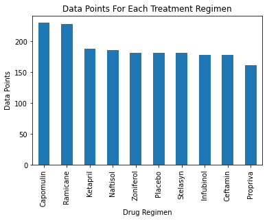
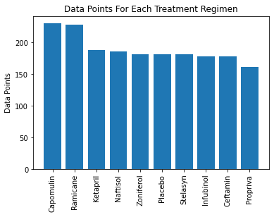
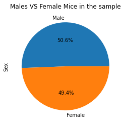
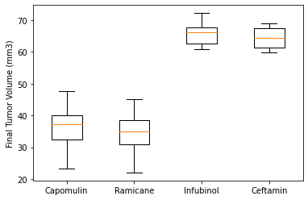
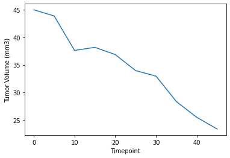
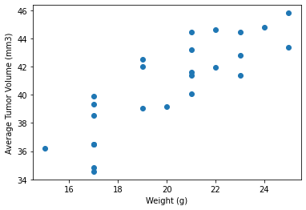
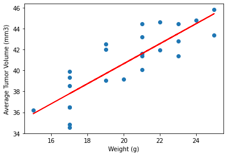

## Observations and Insights

### The bar graphs display capumulin is the best drug to treat tumors in mice. 
### According to the scatter plot for the campulin data for a mouse from the combined_data. 
### It showed a positive relationship in the reduction of mouse tumor over a period of time. 
### Another positive relationship displayed in the scatter plot was the weight of the mice and the tumor volume for campulin. 
### This relationship was backed by the high and postive correlation and a line of best fit. 

## Dependencies and starter code


```python
%matplotlib inline
```


```python
# Dependencies and Setup
import matplotlib.pyplot as plt
import pandas as pd
import scipy.stats as st
import numpy as np
# Study data files
mouse_metadata = "data/Mouse_metadata.csv"
study_results = "data/Study_results.csv"

# Read the mouse data and the study results
mouse_metadata = pd.read_csv(mouse_metadata)
study_results = pd.read_csv(study_results)

# Combine the data into a single dataset
combined_data = pd.merge(mouse_metadata, study_results , how='left', on='Mouse ID')
combined_data.head()
```


<div>
<style scoped>
    .dataframe tbody tr th:only-of-type {
        vertical-align: middle;
    }

    .dataframe tbody tr th {
        vertical-align: top;
    }

    .dataframe thead th {
        text-align: right;
    }
</style>
<table border="1" class="dataframe">
  <thead>
    <tr style="text-align: right;">
      <th></th>
      <th>Mouse ID</th>
      <th>Drug Regimen</th>
      <th>Sex</th>
      <th>Age_months</th>
      <th>Weight (g)</th>
      <th>Timepoint</th>
      <th>Tumor Volume (mm3)</th>
      <th>Metastatic Sites</th>
    </tr>
  </thead>
  <tbody>
    <tr>
      <th>0</th>
      <td>k403</td>
      <td>Ramicane</td>
      <td>Male</td>
      <td>21</td>
      <td>16</td>
      <td>0</td>
      <td>45.000000</td>
      <td>0</td>
    </tr>
    <tr>
      <th>1</th>
      <td>k403</td>
      <td>Ramicane</td>
      <td>Male</td>
      <td>21</td>
      <td>16</td>
      <td>5</td>
      <td>38.825898</td>
      <td>0</td>
    </tr>
    <tr>
      <th>2</th>
      <td>k403</td>
      <td>Ramicane</td>
      <td>Male</td>
      <td>21</td>
      <td>16</td>
      <td>10</td>
      <td>35.014271</td>
      <td>1</td>
    </tr>
    <tr>
      <th>3</th>
      <td>k403</td>
      <td>Ramicane</td>
      <td>Male</td>
      <td>21</td>
      <td>16</td>
      <td>15</td>
      <td>34.223992</td>
      <td>1</td>
    </tr>
    <tr>
      <th>4</th>
      <td>k403</td>
      <td>Ramicane</td>
      <td>Male</td>
      <td>21</td>
      <td>16</td>
      <td>20</td>
      <td>32.997729</td>
      <td>1</td>
    </tr>
  </tbody>
</table>
</div>


## Summary statistics


```python
# Generate a summary statistics table of mean, median, variance, standard deviation, and SEM of the tumor volume for each regimen
summary_statistics = pd.DataFrame({"Tumor Volume (mm3) means": combined_data.groupby('Drug Regimen').mean()['Tumor Volume (mm3)'],
                                    "Tumor Volume (mm3) medians": combined_data.groupby('Drug Regimen').median()['Tumor Volume (mm3)'],
                                    "Tumor Volume (mm3) variances": combined_data.groupby('Drug Regimen').var()['Tumor Volume (mm3)'],
                                    "Tumor Volume (mm3) sds": combined_data.groupby('Drug Regimen').std()['Tumor Volume (mm3)'],
                                    "Tumor Volume (mm3) sems": combined_data.groupby('Drug Regimen').sem()['Tumor Volume (mm3)']
                                   
                                  })
summary_statistics.head(9)                                  
```


<div>
<style scoped>
    .dataframe tbody tr th:only-of-type {
        vertical-align: middle;
    }

    .dataframe tbody tr th {
        vertical-align: top;
    }

    .dataframe thead th {
        text-align: right;
    }
</style>
<table border="1" class="dataframe">
  <thead>
    <tr style="text-align: right;">
      <th></th>
      <th>Tumor Volume (mm3) means</th>
      <th>Tumor Volume (mm3) medians</th>
      <th>Tumor Volume (mm3) variances</th>
      <th>Tumor Volume (mm3) sds</th>
      <th>Tumor Volume (mm3) sems</th>
    </tr>
    <tr>
      <th>Drug Regimen</th>
      <th></th>
      <th></th>
      <th></th>
      <th></th>
      <th></th>
    </tr>
  </thead>
  <tbody>
    <tr>
      <th>Capomulin</th>
      <td>40.675741</td>
      <td>41.557809</td>
      <td>24.947764</td>
      <td>4.994774</td>
      <td>0.329346</td>
    </tr>
    <tr>
      <th>Ceftamin</th>
      <td>52.591172</td>
      <td>51.776157</td>
      <td>39.290177</td>
      <td>6.268188</td>
      <td>0.469821</td>
    </tr>
    <tr>
      <th>Infubinol</th>
      <td>52.884795</td>
      <td>51.820584</td>
      <td>43.128684</td>
      <td>6.567243</td>
      <td>0.492236</td>
    </tr>
    <tr>
      <th>Ketapril</th>
      <td>55.235638</td>
      <td>53.698743</td>
      <td>68.553577</td>
      <td>8.279709</td>
      <td>0.603860</td>
    </tr>
    <tr>
      <th>Naftisol</th>
      <td>54.331565</td>
      <td>52.509285</td>
      <td>66.173479</td>
      <td>8.134708</td>
      <td>0.596466</td>
    </tr>
    <tr>
      <th>Placebo</th>
      <td>54.033581</td>
      <td>52.288934</td>
      <td>61.168083</td>
      <td>7.821003</td>
      <td>0.581331</td>
    </tr>
    <tr>
      <th>Propriva</th>
      <td>52.322552</td>
      <td>50.854632</td>
      <td>42.351070</td>
      <td>6.507770</td>
      <td>0.512884</td>
    </tr>
    <tr>
      <th>Ramicane</th>
      <td>40.216745</td>
      <td>40.673236</td>
      <td>23.486704</td>
      <td>4.846308</td>
      <td>0.320955</td>
    </tr>
    <tr>
      <th>Stelasyn</th>
      <td>54.233149</td>
      <td>52.431737</td>
      <td>59.450562</td>
      <td>7.710419</td>
      <td>0.573111</td>
    </tr>
  </tbody>
</table>
</div>


## Bar plots


```python
# Generate a bar plot showing number of data points for each treatment regimen using pandas
drug_count = combined_data['Drug Regimen'].value_counts().plot(kind = "bar")
plt.xlabel("Drug Regimen") 
plt.ylabel("Data Points") 
plt.title("Data Points For Each Treatment Regimen")
```


    Text(0.5, 1.0, 'Data Points For Each Treatment Regimen')





```python
drug_regimen = combined_data['Drug Regimen'].value_counts().index
drug_regimen
```


    Index(['Capomulin', 'Ramicane', 'Ketapril', 'Naftisol', 'Zoniferol', 'Placebo',
           'Stelasyn', 'Infubinol', 'Ceftamin', 'Propriva'],
          dtype='object')


```python
# Generate a bar plot showing number of data points for each treatment regimen using pyplot
drug_regimen_count = combined_data['Drug Regimen'].value_counts()
drug_regimen = combined_data['Drug Regimen'].value_counts().index
plt.bar(drug_regimen,drug_regimen_count)
plt.xticks(rotation=90)
plt.ylabel("Data Points") 
plt.title("Data Points For Each Treatment Regimen")
```


    Text(0.5, 1.0, 'Data Points For Each Treatment Regimen')





## Pie plots


```python
# Generate a pie plot showing the distribution of female versus male mice using pandas
distribution_sex = combined_data['Sex'].value_counts().plot(kind="pie",autopct='%1.1f%%')
plt.title("Males VS Female Mice in the sample")
```


    Text(0.5, 1.0, 'Males VS Female Mice in the sample')





```python
# Generate a pie plot showing the distribution of female versus male mice using pyplot
distribution_sex_count = combined_data['Sex'].value_counts()
distribution_sex = combined_data['Sex'].value_counts().index
plt.pie(distribution_sex_count,labels=distribution_sex, autopct='%1.1f%%')
plt.ylabel("Sex")
plt.title("Males VS Female Mice in the sample")
plt.show()
```


## Quartiles, outliers and boxplots


```python
# Calculate the final tumor volume of each mouse across four of the most promising treatment regimens. 
# Calculate the IQR and quantitatively determine if there are any potential outliers. 

# Group the data, then organize it according to the max time point. 
tumor_volume = combined_data.sort_values(["Drug Regimen", "Mouse ID", "Timepoint"], ascending=True)
max_tumor_volume = tumor_volume.loc[tumor_volume["Timepoint"]== 45].reset_index()

# Select capomulin from the data set 
capomulin = max_tumor_volume.loc[max_tumor_volume["Drug Regimen"] == "Capomulin"]['Tumor Volume (mm3)']

# Select ramicane from the data set 
ramicane = max_tumor_volume.loc[max_tumor_volume["Drug Regimen"] == "Ramicane"]['Tumor Volume (mm3)']

# Select infubinol from the data set 
infubinol = max_tumor_volume.loc[max_tumor_volume["Drug Regimen"] == "Infubinol"]['Tumor Volume (mm3)']

# Select ceftamin from the data set 
ceftamin = max_tumor_volume.loc[max_tumor_volume["Drug Regimen"] == "Ceftamin"]['Tumor Volume (mm3)']
```


```python
# Capomulin Quartiles
quartiles = capomulin.quantile([.25,.5,.75])
lowerq = quartiles[0.25]
upperq = quartiles[0.75]
iqr = upperq-lowerq

print(f"The lower quartile of capomulin is: {lowerq}")
print(f"The upper quartile of capomulin is: {upperq}")
print(f"The interquartile range of capomulin is: {iqr}")
print(f"The the median of capomulin is: {quartiles[0.5]} ")

lower_bound = lowerq - (1.5*iqr)
upper_bound = upperq + (1.5*iqr)
print(f"Values below {lower_bound} could be outliers.")
print(f"Values above {upper_bound} could be outliers.")
```

    The lower quartile of capomulin is: 32.37735684
    The upper quartile of capomulin is: 40.1592203
    The interquartile range of capomulin is: 7.781863460000004
    The the median of capomulin is: 37.31184577 
    Values below 20.70456164999999 could be outliers.
    Values above 51.83201549 could be outliers.


```python
# Ramicane Quartiles
quartiles = ramicane.quantile([.25,.5,.75])
lowerq = quartiles[0.25]
upperq = quartiles[0.75]
iqr = upperq-lowerq

print(f"The lower quartile of ramicane is: {lowerq}")
print(f"The upper quartile of ramicane is: {upperq}")
print(f"The interquartile range of ramicane is: {iqr}")
print(f"The the median of ramicane is: {quartiles[0.5]} ")

lower_bound = lowerq - (1.5*iqr)
upper_bound = upperq + (1.5*iqr)
print(f"Values below {lower_bound} could be outliers.")
print(f"Values above {upper_bound} could be outliers.")
```

    The lower quartile of ramicane is: 30.981175224999998
    The upper quartile of ramicane is: 38.508305307499995
    The interquartile range of ramicane is: 7.527130082499998
    The the median of ramicane is: 34.848627300000004 
    Values below 19.690480101250003 could be outliers.
    Values above 49.79900043124999 could be outliers.


```python
# Infubinol Quartiles
quartiles = infubinol.quantile([.25,.5,.75])
lowerq = quartiles[0.25]
upperq = quartiles[0.75]
iqr = upperq-lowerq

print(f"The lower quartile of infubinol is: {lowerq}")
print(f"The upper quartile of infubinol is: {upperq}")
print(f"The interquartile range of infubinol is: {iqr}")
print(f"The the median of infubinol is: {quartiles[0.5]} ")

lower_bound = lowerq - (1.5*iqr)
upper_bound = upperq + (1.5*iqr)
print(f"Values below {lower_bound} could be outliers.")
print(f"Values above {upper_bound} could be outliers.")
```

    The lower quartile of infubinol is: 62.75445141
    The upper quartile of infubinol is: 67.68556862
    The interquartile range of infubinol is: 4.9311172099999965
    The the median of infubinol is: 66.08306589 
    Values below 55.35777559500001 could be outliers.
    Values above 75.08224443499999 could be outliers.


```python
# Ceftamin Quartiles
quartiles = ceftamin.quantile([.25,.5,.75])
lowerq = quartiles[0.25]
upperq = quartiles[0.75]
iqr = upperq-lowerq

print(f"The lower quartile of ceftamin is: {lowerq}")
print(f"The upper quartile of ceftamin is: {upperq}")
print(f"The interquartile range of ceftamin is: {iqr}")
print(f"The the median of ceftamin is: {quartiles[0.5]} ")

lower_bound = lowerq - (1.5*iqr)
upper_bound = upperq + (1.5*iqr)
print(f"Values below {lower_bound} could be outliers.")
print(f"Values above {upper_bound} could be outliers.")
```

    The lower quartile of ceftamin is: 61.43389223
    The upper quartile of ceftamin is: 67.52748237
    The interquartile range of ceftamin is: 6.093590140000003
    The the median of ceftamin is: 64.29983003 
    Values below 52.29350701999999 could be outliers.
    Values above 76.66786758 could be outliers.


```python
# Generate a box plot of the final tumor volume of each mouse across four regimens of interest
plt.boxplot([capomulin,ramicane,infubinol,ceftamin],labels=['Capomulin','Ramicane','Infubinol','Ceftamin'])
plt.ylabel('Final Tumor Volume (mm3)')
plt.show()
```





# Line and scatter plots

### Capomulin Data Compilation 


```python
# Locate compulin data in the combined_data. 
compulin_data = combined_data.loc[combined_data['Drug Regimen'] == "Capomulin"]
```


```python
# Generate a line plot of time point versus tumor volume for a mouse treated with Capomulin
s185_data = compulin_data.loc[compulin_data['Mouse ID']== 's185']
plt.plot(s185_data['Timepoint'],s185_data['Tumor Volume (mm3)'])
plt.xlabel('Timepoint')
plt.ylabel('Tumor Volume (mm3)')

```


    Text(0, 0.5, 'Tumor Volume (mm3)')





```python
# Generate a scatter plot of mouse weight versus average tumor volume for the Capomulin regimen
tumor_average = capomulin_data.groupby(['Mouse ID']).mean()
plt.scatter(tumor_average['Weight (g)'],tumor_average['Tumor Volume (mm3)'])
plt.xlabel('Weight (g)')
plt.ylabel('Average Tumor Volume (mm3)')
plt.show()
```





```python
# Calculate the correlation coefficient and linear regression model for mouse weight and average tumor volume for the Capomulin regimen
tumor_average = capomulin_data.groupby(['Mouse ID']).mean()
plt.scatter(tumor_average['Weight (g)'],tumor_average['Tumor Volume (mm3)'])
plt.xlabel('Weight (g)')
plt.ylabel('Average Tumor Volume (mm3)')

# Find correlation between mouse weight and tumor volume
weight_avg_correlation = round(st.pearsonr(tumor_average['Weight (g)'],tumor_average['Tumor Volume (mm3)'])[0],2)
print(f"The correlation between mouse weight and tumor volume is {weight_avg_correlation}.")

# Equation for regression and line of best fit 
linegress = st.linregress(tumor_average['Weight (g)'],tumor_average['Tumor Volume (mm3)'])
y_values = tumor_average['Weight (g)']*linegress[0]+linegress[1]
plt.plot(tumor_average['Weight (g)'], y_values, color = 'red')


```

    The correlation between mouse weight and tumor volume is 0.84.


    [<matplotlib.lines.Line2D at 0x12c00a358>]





```python

```
